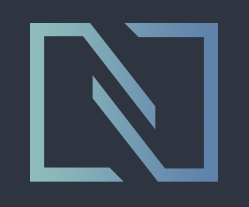

  

  
  
  
  
<h3>:shipit: Oh Hello There! </h3>

---

🍛 After being for some time on the Gruvbox colorscheme I decided to try Nord and properly try things in i3, as my last rice...
Hope you guys like it! Kinda finished this days before an exam I kinda didn't pay too much attention :laughing:

<h3>Some Details about my setup...</h3>

  

- **WM**                            : [i3](https://github.com/FrenzyExists/Nord-dot-files-i3/tree/main/config/i3) lul :bento:
- **DM***                           : [Lightdm](https://wiki.archlinux.org/index.php/LightDM) 🍃 Currently the default one lul
- **Shell**                         : [zsh](https://wiki.archlinux.org/index.php/zsh) :wrench:
- **Terminal**                      : [Alacritty](https://github.com/alacritty/alacritty) & [Kitty](https://github.com/kovidgoyal/kitty). :framed_picture: Yes, I dual terminal, fight me
- **Bar**                           : [Polybar](https://github.com/polybar/polybar) 🍫
- **Compositor**                    : [picom](https://github.com/yshui/picom) 🎇 
- **Text Editor**                   : [nvim](https://github.com/neovim/neovim) 🗒
- **Music Player**                  : [cmus](https://wiki.archlinux.org/index.php/Cmus)
- **Wallpaper Manager**             : [nitrogen](https://wiki.archlinux.org/index.php/Nitrogen) :art:
- **Notify Daemon**                 : [dunst](https://wiki.archlinux.org/index.php/Dunst) 📋
- **File Manager**                  : [ranger](https://github.com/ranger/ranger) 📁
- **Application Launcher**          : [rofi](https://github.com/davatorium/rofi) 🎒
- **Code Editor**                   : [Vscode](https://code.visualstudio.com/) 
- **Backlight**                     : [xbacklight](https://wiki.archlinux.org/index.php/Backlight) :sun:
- **Picture**                       : [sxiv](https://wiki.archlinux.org/index.php/sxiv) r
- **Video Player**                  : [mpv](https://wiki.archlinux.org/index.php/Mpv) :movie_camera:
- **Media Controller**              : [playerctl](https://github.com/altdesktop/playerctl) :control_knobs:
- **Cursor**                        : [nord-oreo](https://github.com/0jdxt/oreo-nord-cursors) 🐭
- **Spicetify**                     : [nord-theme](https://github.com/morpheusthewhite/spicetify-themes/tree/master/Nord) 🎵

  

<h3 align="center"> :sparkle: ✨ Nord White  ✨ :sparkle: </h3>

  

  

### Mousepdad and Keyboard
I pretty much used the configuration explained here https://cravencode.com/post/essentials/enable-tap-to-click-in-i3wm/ and applied it to /etc/X11/xorg.conf.d/
Creddit for configuration goes for Cody Craven :)2

Also yeah, I use spotify, shut up

## Shameless Plug :v
---
### :computer: Visit my Website :D

### :star: Smash the Star Button

### :rice: Steal my dots!!!!

## TODO:
---
- [ ] Add Scheme switch script
- [ ] Glorify theme
- [ ] Profit (hehe)

