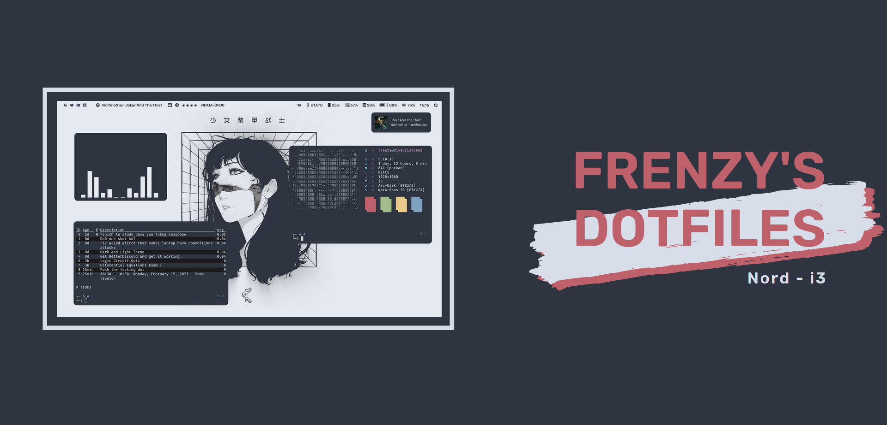
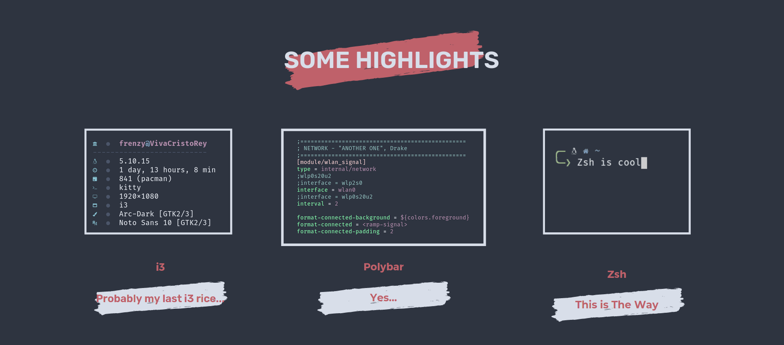
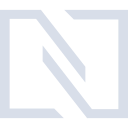
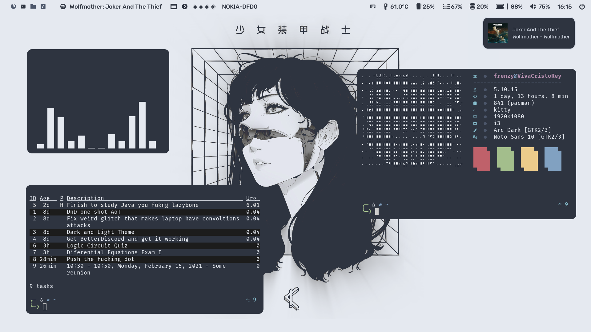
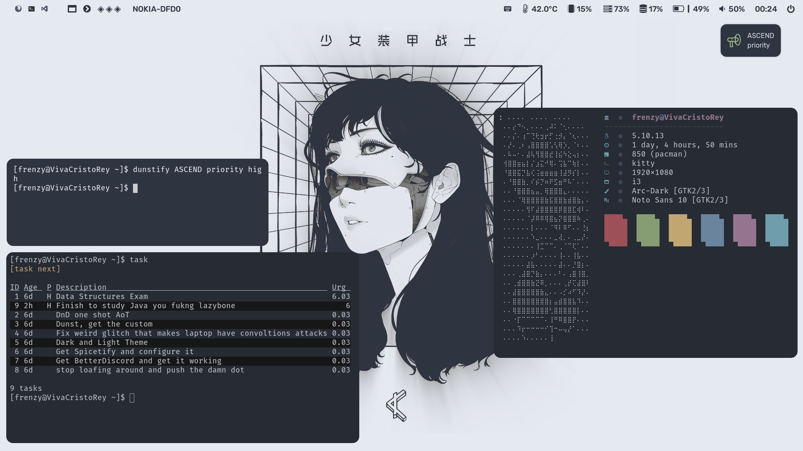
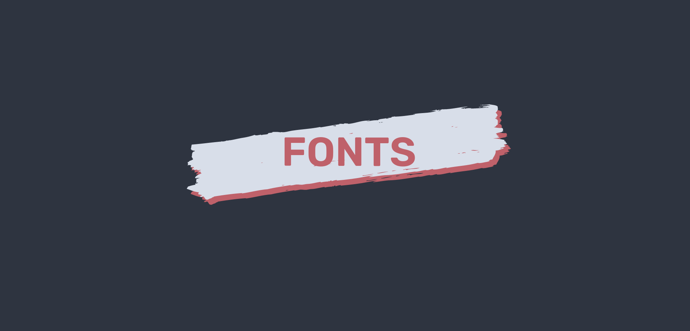
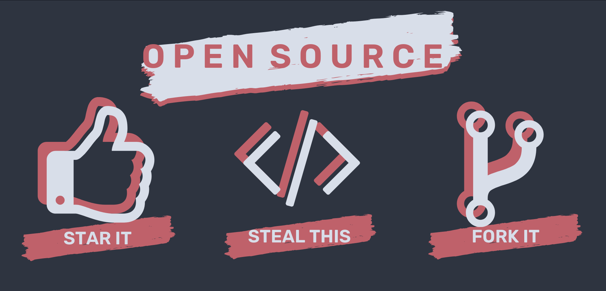

  

  
  
  

<h3>:shipit: Oh Hello There! </h3>

---

🍛 After being for some time on the Gruvbox colorscheme I decided to try Nord and properly try things in i3, as my last rice...
Hope you guys like it! Kinda finished this days before an exam I kinda didn't pay too much attention :laughing:

<h3>Some Details about my setup...</h3>

  

- **WM**                            : [i3](https://github.com/FrenzyExists/Nord-dot-files-i3/tree/main/config/i3) lul :bento:
- **DM***                           : [Lightdm](https://wiki.archlinux.org/index.php/LightDM) 🍃 Currently the default one lul
- **Shell**                         : [zsh](https://wiki.archlinux.org/index.php/zsh) :wrench:
- **Terminal**                      : [Alacritty](https://github.com/alacritty/alacritty) & [Kitty](https://github.com/kovidgoyal/kitty). :framed_picture: Yes, I dual terminal, fight me
- **Bar**                           : [Polybar](https://github.com/polybar/polybar) 🍫
- **Compositor**                    : [picom](https://github.com/yshui/picom) 🎇 
- **Text Editor**                   : [nvim](https://github.com/neovim/neovim) 🗒
- **Music Player**                  : [cmus](https://wiki.archlinux.org/index.php/Cmus) 🎶
- **Wallpaper Manager**             : [nitrogen](https://wiki.archlinux.org/index.php/Nitrogen) :art:
- **Notify Daemon**                 : [dunst](https://wiki.archlinux.org/index.php/Dunst) 📋
- **File Manager**                  : [ranger](https://github.com/ranger/ranger) 📁
- **Application Launcher**          : [rofi](https://github.com/davatorium/rofi) 🎒
- **Code Editor**                   : [Vscode](https://code.visualstudio.com/) 🤖 
- **Backlight**                     : [xbacklight](https://wiki.archlinux.org/index.php/Backlight) ☀
- **Picture**                       : [sxiv](https://wiki.archlinux.org/index.php/sxiv) 🖼
- **Video Player**                  : [mpv](https://wiki.archlinux.org/index.php/Mpv) :movie_camera:
- **Media Controller**              : [playerctl](https://github.com/altdesktop/playerctl) :control_knobs:
- **Cursor**                        : [nord-oreo](https://github.com/0jdxt/oreo-nord-cursors) 🐭
- **Spicetify**                     : [nord-theme](https://github.com/morpheusthewhite/spicetify-themes/tree/master/Nord) 🗻
- **Screenshot**                     : [maim](https://github.com/morpheusthewhite/spicetify-themes/tree/master/Nord) 📸

 

## Keybinds ✍️

These are the basic keybinds. Read through the `keybindings` file located at `i3/scripts` or tap the ⌨ icon at polybar for more keybinds like increasing gaps and restoring gaps.

|        Keybind         |                 Function                 |
| ---------------------- | ---------------------------------------- |
| `Win + Enter`          | Launch terminal (kitty)                  |
| `Win + Shift + Enter`  | Launch terminal (alacritty)              |
| `Win + Q`              | Close window                             |
| `Win + D`              | Open rofi menu                           |
| `Win + Shift + E`      | Toggle where next windows appear         | 
| `Win + Shift + Q`      | Open rofi powermenu                      |
| `Win + S`              | Clear Workspace                          |
| `Win + Shift + S`      | Toggle Sidebar (when I make one)         |
| `Win + P`              | Take Screenshot and copies to clipboard  |
| `Win + Shift + P`      | Take Screenshot and copies to clisystem  |
| `Win + B`              | Split in Horizontal                      |
| `Win + V`              | Split in Vertical                        |
| `Win + T`              | Open kitty on ranger                     |
| `Win + H`              | Navigate through windows                 |
| `Win + J`              | Navigate through windows                 |
| `Win + K`              | Navigate through windows                 |
| `Win + Space`          | Switch between floating and tiled window |
| `Win + Shift + L`      | Navigate through windows                 |
| `Win + Shift + H`      | Navigate through windows                 |
| `Win + Shift + J`      | Navigate through windows                 |
| `Win + Shift + K`      | Navigate through windows                 |
| `Win + Shift + L`      | Navigate through windows                 |

Note: `Toggling` means to enable if inactive or to disable if active.

Note: `Win` refers to the `Super` key.

 

## Workflow 🖨️
# 🚧 STILL IN CONSTRUCTION LUL 🚧

Don't rice for unique complicated workflow, rice for simple human workflow

  

# Will soon add a vid screencapture when I figure out how 🤦
 

  

<h3 align="center"> :sparkle: ✨ Nord White  ✨ :sparkle: </h3>

  

  

### Mousepdad and Keyboard
I pretty much used the configuration explained by [Cody Craven ](https://cravencode.com/post/essentials/enable-tap-to-click-in-i3wm/) and applied it to `/etc/X11/xorg.conf.d/`

  

I Use FuraCode Nerd Fonts for the icons and Rubik for everything

___
 
Also yeah, I use spotify, shut up

## ASCII ART
You can make something like that from the configs by going [here](http://patorjk.com/software/taag/)

  

## TODO 🗒
- [ ] Add Scheme switch script
- [ ] Glorify theme
- [ ] Profit (hehe)

